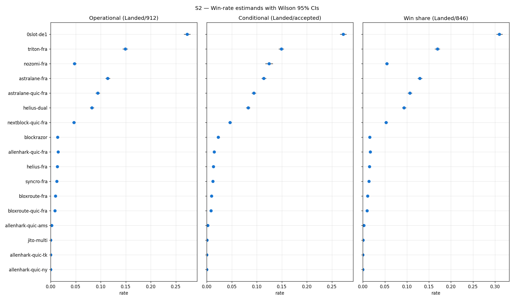
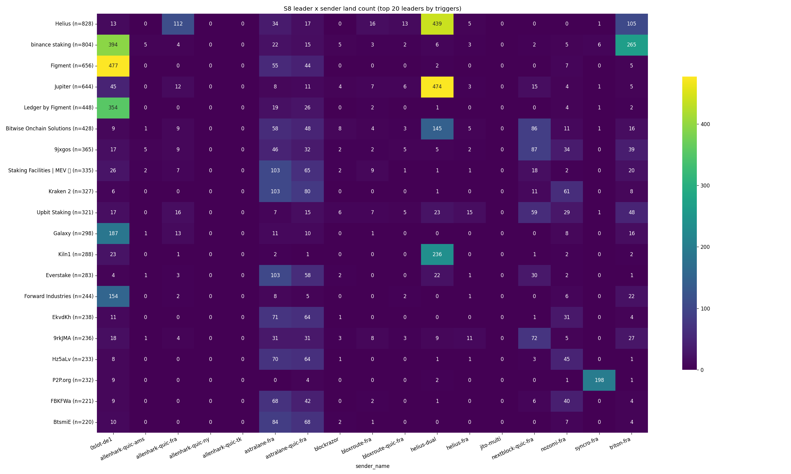
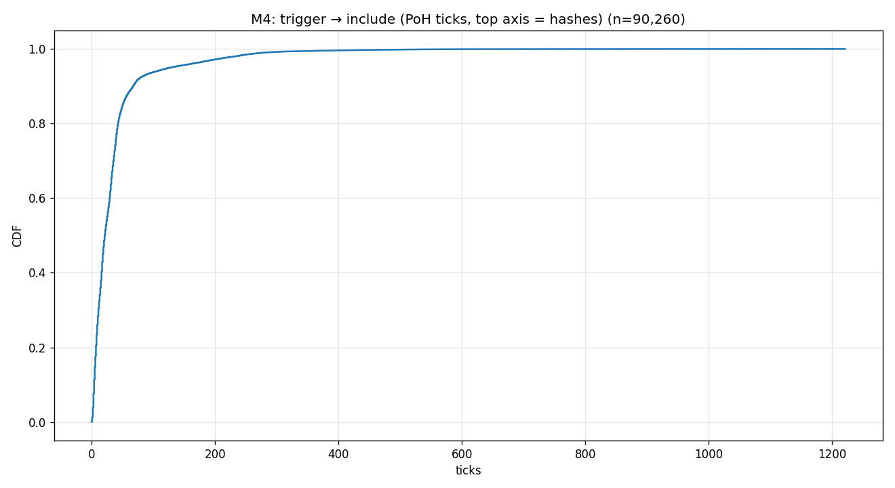

# Winning the block on Solana

A measurement study of how transactions actually get included on Solana. Where the validators live, which
data firehose sees the chain first, how fast a single sender lands, and what happens when you race seventeen
senders at once. Every number here comes from synthetic self-transfers, so it measures the **sending path**,
not any trading strategy.

**[Read the full write-up (with charts) &rarr;](https://JakubJaksik.github.io/solana-sender-analysis/)**

<sub>17 senders raced head to head · 380,596 timed send attempts · 13.7M matched shred-entries · latency
measured in Proof-of-History ticks, not wall-clock · client resident in Frankfurt</sub>

---

## The short version

On Solana there is no shared mempool. A leader validator is scheduled ahead of time, holds four consecutive
slots (about 1.6 seconds), and you have to reach that specific machine before its block closes. That makes
"how do I get included" a concrete, measurable question. I answered four of them.

**1. Geography is a coarse lever.** Europe produces about 65% of slots and holds about 52% of validators. A
client in Frankfurt already lands transactions roughly in proportion to where slots are produced, so adding a
second continent buys only a few percentage points. The interesting geographic effect is much finer grained,
and it shows up per data center in the race below.

**2. ShredStream sees the chain first.** Over a two-hour run that matched 13,662,904 entries in both streams,
Jito ShredStream beat a Yellowstone gRPC node on 98 to 99.5% of entries, with a median head start around 7 ms.
Small, but consistent across the whole network, and 7 ms is a real fraction of a 400 ms slot.

**3. A single sender lands in about 21 ticks.** Firing 90,260 transactions at scheduled Proof-of-History ticks
through Helius Sender, the median inclusion distance is 21 ticks, about 90% land inside one slot, and the tail
is almost entirely a distance-to-leader effect.

**4. Speed does not win the race.** This was the surprise. Racing 17 senders on the same trigger, the sender
that lands fastest is not the one that wins most. Winning is a routing problem, decided per leader and per
data center rather than by wire latency.

---

## The finding that mattered

I expected the lowest-latency client to win. It does not. The correlation between a sender's median latency and
its win-rate is not statistically significant. 0slot lands slower than most senders yet wins the most, because
its edge is peering and routing to the leader, not transport speed.

The leader-by-sender win matrix is nearly diagonal: most leaders have "their" sender. Adding "which sender
reached this leader" to a model of inclusion raises the fit from an R² of 0.01 to 0.40, while stake barely
correlates with inclusion at all (r near 0.02).



*Win-rate for every sender with 95% Wilson intervals, under three definitions. 0slot leads under any of them.
The senders whose dots jump right between the panels were rate-limited: they look mediocre until you stop
counting attempts they were never allowed to send.*



*Land count for the top 20 leaders (rows) against each sender (columns). The bright cells are nearly diagonal.
Reaching a given leader is a specific sender's job, not a general one.*

Two structural facts explain why even slow senders keep landing. A leader holds four consecutive slots, so
landing "one slot late" is usually the same validator (only about 7.5% of wins involved a real leader change).
And on the one timing metric available for losers too, the eventual winner was the fastest sender only 27% of
the time. Being first out the door is not being first into the block.

---

## Why the clock is Proof-of-History

Wall-clock latency across machines is noisy: clocks drift, and "on chain" is fuzzy when you only see your own
copy of the stream. Solana gives you a better ruler. Proof-of-History is a hash chain the leader ticks forward
at a near-constant rate, so the chain itself is a clock:

- one slot ≈ 64 ticks ≈ 400 ms ≈ 4,000,000 hashes
- one tick ≈ 6.25 ms ≈ 62,500 hashes
- a leader holds 4 consecutive slots

Measuring "how far did the chain advance between my trigger and my inclusion" in ticks and hashes gives a
deterministic distance that is identical for every observer, with no clock sync required. Wall-clock is kept
too, but the tick delta is the honest number.



*Trigger to inclusion for 90,260 transactions, in PoH ticks. Median about 21 ticks, roughly 90% within one
slot, then a long tail that turns out to be distance to the leader.*

---

## Repository map

```
docs/                         The write-up (GitHub Pages site) and all charts
crates/                       Rust measurement tools (Cargo workspace)
  solana-leader-map/          per-epoch validator -> location + leader schedule
  entry-sources/              ShredStream reassembly + Yellowstone gRPC ingestion
  entry-comparator/           matches entries across both streams, records who saw it first
  tick-trigger-bench/         single-sender latency in PoH ticks
  tick-trigger-fan-out-bench/ the 17-sender durable-nonce race
analysis/                     Python analysis
  source-comparison/          ShredStream vs Yellowstone (entry-comparator output)
  latency/                    single-sender latency + geo cross-check
  fanout/                     the statistics suite (Wilson CIs, McNemar, Bradley-Terry, logit) + tests
```

Each area has its own README. Start with [`crates/README.md`](crates/README.md) for the measurement tools and
[`analysis/README.md`](analysis/README.md) for the statistics.

## Running it

The Rust tools are a standard Cargo workspace (Rust 2024, 1.85+):

```bash
cd crates
cargo build --release
cargo run --release -p solana-leader-map -- --help
```

The Python analysis expects the run outputs (Parquet / JSONL) that the benches produce. Raw run data is large
and not committed; small summary CSVs and the integrity report are included as samples. See
[`analysis/README.md`](analysis/README.md).

Each tool reads a `config.json` for endpoints and keys. The committed `config.example.json` files use
placeholders for anything private; no tokens, private endpoints, or wallet keys are in this repository. Public
vendor endpoints (Helius, Jito, and so on) appear as defaults.

## Caveats

- Latency is measured only for transactions that landed (selection bias) and cannot be paired at the trigger
  level, so latency comparisons are distribution-based, not paired.
- "On chain" means "visible in our stream". The gap to the leader's true emission is Turbine propagation, a few
  milliseconds, not measured directly.
- Proof-of-History does not tick at a perfectly constant rate; the raw tick and hash counts are the precise
  measure, the millisecond conversions are approximate.
- Geographic cells are thin. Only a handful of leaders were hit often enough for inference, so per-country and
  per-validator numbers are descriptive.
- Confidence intervals are within-run. One run is not a persistent ranking, and sender peering changes over time.

## License

MIT. See [LICENSE](LICENSE).
